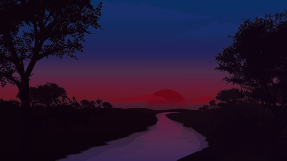

# Timed Background Generator

This bash script will create timed backgrounds for GNOME display managers. Based on Kali's timed theme—more on that later. 
Ideally, you're gonna wanna choose a well-lit background (think daytime lighting conditions).

 
<h2>Instructions</h2>

1. clone this repo locally 
$ git clone https://github.com/X0RW3LL/tbgen.git  
2. cd into the repo 
$ cd tbgen  
3. Make sure tbgen.sh has execute permissions 
$ chmod +x tbgen.sh  
4. Copy and paste the image of your choice inside the repo 
$ cp /path/to/image .  
5. Run the script with the image as the first argument 
$ ./tbgen.sh your_image.jpg 
<strong>OR</strong> 
$ sh tbgen.sh your_image.jpg

 
<h2>Inspiration</h2>

 I was tinkering around Kali's background when I came across one that's timed based on the time of day. It's lighter and brighter during daytime, and gets darker towards night time. I just <strong>had</strong> to figure out how it worked. 
I went through gnome-tweaks ($ sudo apt install gnome-tweaks), got the location of said background (/usr/share/backgrounds/gnome/adwaita-timed.xml) and made sense of how it worked. 
I thought it would be cool to create custom ones at will. Hence the idea for this script came to being.

 
<h2>What does the script actually do?</h2>

1. Checks if you have ImageMagick installed, and installs it if it's not on your system—we need this package to modulate the brightness of the image 
2. Creates a directory called timed_themes (and checks if it already exists on later runs) 
3. Creates 2 images with 66% and 33% brightness, respectively, titled day-image and night-image, respectively 
4. Copies the image you passed in as an argument to the timed_themes directory
5. Creates an xml file (based on adwaita-timed.xml , many thanks for the original author(s)), and uses the newly generated images in place
6. Sets your <strong>desktop</strong> background image to the newly generated timed background. Kindly note that it will only change your desktop background image, and not the lockscreen image. Refer to <strong>Limitations</strong> for more

 
<h2>Limitations</h2>

1. I'm not, by any means, skilled at bash scripting; the timed image will preserve its extension (aka if you have image.png, the generated image will be titled image.png.xml). It still runs without a hitch, but I know it does bug me when it comes to aesthetics 
2. Some images might not be perfect in terms of brightness modulation. Unfortunately, I don't have an immediate workaround to analyze the image beforehand 
3. This script will only change the desktop background, not the lockscreen image.
4. This has only been tested on GNOME. I do not know whether or not this works on other display managers like XFCE, MATE, KDE, etc.

 
<h2>Troubleshooting</h2>

<strong>Artifacts in brighter areas of the image when later towards the evening</strong> 
Current workaround: choose a different image, or play around in the modulation value in the script 
<strong>Xsession broke, I'm logged out, and I can't log back in. WTF did you do?</strong> 
Current workaround: 
1. Switch to a tty2 session 
CTRL + ALT + F2 
2. Provide your username, followed by your password 
3. Change your desktop background to the image your provided with the following command 
gsettings set org.gnome.desktop.background picture-uri file:///path/to/your_image.jpg 
For example, if your your_image.jpg is in the repo, and your username is userx, issue the following command: 
gsettings set org.gnome.desktop.background picture-uri file:///home/userx/tbgen/your_image.jpg 
4. Exit out of the tty2 session, and proceed to login to your Xsession 
$ exit 
<strong>Note: </strong>I did run into this issue at first because I handled the path to the image incorrectly. It works fine now

 
<h2>Credits</h2>

The entire Linux and Open Source community 
The Kali Linux team: <a href="https://twitter.com/kalilinux">&#64;kalilinux</a> 
Stök Fredrik: <a href="https://twitter.com/stokfredrik">&#64;stokfredrik</a>, for inspiration with his Medium post: <a href="https://medium.com/@stokochtrubbel/how-to-make-kali-bearable-to-look-at-5593771fafc5">HOW TO MAKE KALI BEARABLE TO LOOK AT..</a> 
Daniel Ruiz: <a href="https://twitter.com/dani_ruiz24">&#64;dani_ruiz24</a>, for his continuous improvements for Kali's themes. Check out his website: <a href="https://drasite.com/">DяA | Daniel Ruiz de Alegría</a> 
The image I'm using: <a href="https://www.pixel4k.com/small-lake-red-sunset-111735.html">Small Lake Red Sunset</a> 
Bash snippet to check for installed packages: https://stackoverflow.com/a/10439058 
 
<h2>Preview Images</h2>

